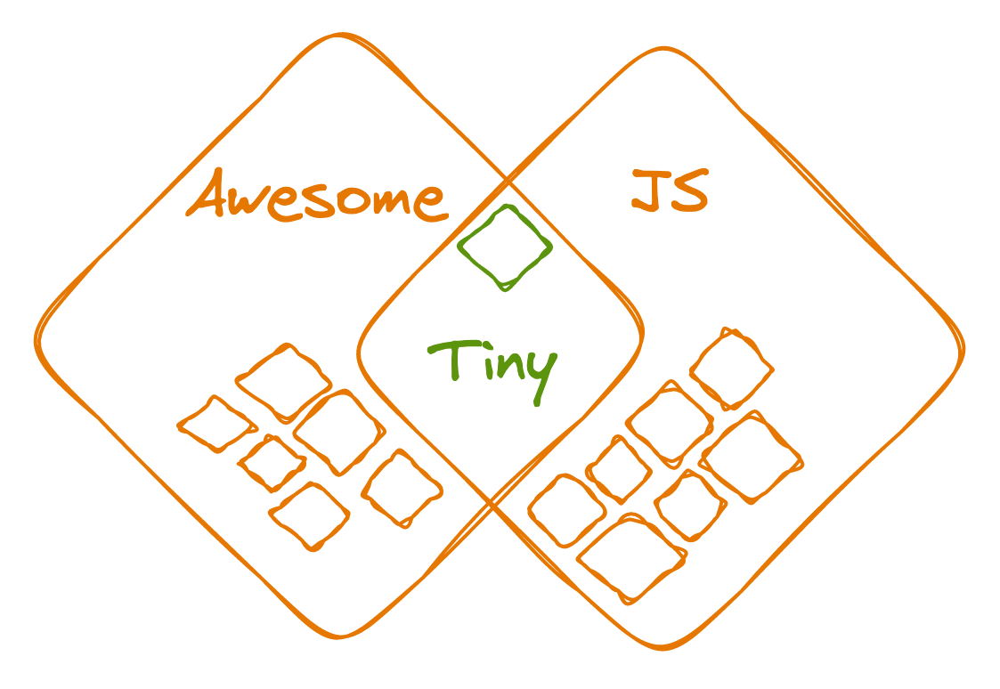

# Awesome Tiny JS 

  

Tiny front-end libraries to put your bundle on a diet. Rules:

- Size is under 2 kB-ish, min + gzip, with all dependencies, except where noted.
- For multi-purpose libraries, the size of a useful subset must be under 2 kB-ish.
- Useful client-side. I haven't figured out participation rules for node-only libraries, and I'm not too worried about them.
- Second-level libraries only allowed for React, Vue, Angular, svelte. 
- 100+ GitHub stars. Libraries with less are awesome, too, but stars indicate some community review.
- No zero-JS (CSS- or type-only) libraries. It's not awesome-css or something.

## Contents

- [UI Frameworks](#ui-frameworks)
- [Event Emitters](#event-emitters)
- [Reactive Programming](#reactive-programming)
- [State Managers](#state-managers)
- [Routers and URL Utils](#routers-and-url-utils)
- [API Layer](#api-layer)
- [I18N](#i18n)
- [Dates and Time](#dates-and-time)
- [Generic Utilities](#generic-utilities)
- [Unique ID Generation](#unique-id-generation)
- [Colors](#colors)

## UI Frameworks

UI frameworks (libraries?) provide declarative templates, event bindings, and observable state to update the view. I've been generous and expanded the size limit for this category to 4.5 kB (if you're boring, count them as 2 libraries), but also increased the star limit to 2K. 

- [preact](https://github.com/preactjs/preact) - React-like API (pre-hooks). Cool ecosystem of similarly tiny tools and components. Highly recommended. 

The following libraries are small and cool, but note they're about [500x less popular than preact.](https://npmtrends.com/fre-vs-hyperapp-vs-million-vs-preact-vs-redom-vs-riot) Kudos for deconstrucing the very essence of a "framework":

- [million](https://github.com/aidenybai/million) - Marketed as a _drop-in replacement for React._ 
- [fre](https://github.com/frejs/fre) - React-like library with hooks and concurrency, 1–3 kB with tree-shaking. 
- [hyperapp](https://github.com/jorgebucaran/hyperapp) - Declarative UI with pure JS syntax and immutable state. 
- [redom](https://github.com/redom/redom) - Hyperapp-style templates with _imperative_ event listeners and updates. 

And if being declarative is not your thing:

- [umbrella](https://github.com/franciscop/umbrella) - jQuery-style DOM manipulation library. 

## Event Emitters

Event emitter pattern is fairly easy to implement yourself, but why bother when you have these cool tools? With an arms race to build the smallest one, the limit is 0.5 kB.

- [mitt](https://github.com/developit/mitt) - Plain event emitter that I use on most projects. 
- [nanoevents](https://github.com/ai/nanoevents) - Nicer unsubscribe API, but no `*` event. 
- [eev](https://github.com/chrisdavies/eev) - More of the same. 
- [onfire.js](https://github.com/hustcc/onfire.js) - Also has `.once` method. 

## Reactive Programming

A step up from a raw event emitter, reactive libraries can build chains of event transforms, filters, and side-effects. You can already use these to build UIs by manually updating DOM on state change:

- [flyd](https://github.com/paldepind/flyd) - Rx-styled event streams. 
- [callbag-basics](https://github.com/staltz/callbag-basics) - Rx-style event streams. 
- [hyperactiv](https://github.com/elbywan/hyperactiv) - 4 functions to make objects observable and listen to changes (mobx-style). 
- [flimsy](https://github.com/fabiospampinato/flimsy) - Signals from Solid (it _almost_ fit into UI frameworks category itself). Author warning: _it's probably buggy._ 

Honorable mention: [oby](https://github.com/vobyjs/oby) _could_ make it _if_ it had tree-shaking, but otherwise is around 7 kB.

## State Managers

State managers combine observable state with actions and framework bindings, intended for app-wide state.

- [zustand](https://github.com/pmndrs/zustand) - Simple stores with pleasant actions and selectors. React  or vanilla 
- [nanostores](https://github.com/nanostores/nanostores) - Modular store with good tree-shaking support  Lots of framework connectors (e.g. React ).
- [exome](https://github.com/marcisbee/exome) - Atomic store with lots of framework connectors 
- [reatom](https://github.com/artalar/reatom) - Reactive stores. 
- [storeon](https://github.com/storeon/storeon) - Minimal redux-styled store with lots of framework connectors 
- [unistore](https://github.com/developit/unistore) - Centralized store with actions for React / preact 
- [teaful](https://github.com/teafuljs/teaful) - Store with useState-like API for React / preact 

## Routers and URL Utils

Do stuff on URL / history changes, with path matching and parsing:

- [wouter](https://github.com/molefrog/wouter) - Declarative router for (p)react , also available as a 400-byte hook.
- [@nanostores/router](https://github.com/nanostores/router) - Routes as a nanostores store (framework-agnostic) 
- [navaid](https://github.com/lukeed/navaid) - History-based observable router 
- [routie](https://github.com/jgallen23/routie) - Hash-based observable router 

Just want to parse or match URL paths without observing them? Here you go:

- [matchit](https://github.com/lukeed/matchit) - Route parser and matcher in 
- [regexparam](https://github.com/lukeed/regexparam) - Convert path to regexp in 
- [qss](https://github.com/lukeed/qss) - Parse querystrings . Not sure you need it, [URL API](https://developer.mozilla.org/en-US/docs/Web/API/URL) support is good. 

## API Layer

`fetch` API has some boilerplate associated with it: serialize & parse data, reject on non-200 response, etc. These tiny packages handle it for you:

- [redaxios](https://github.com/developit/redaxios) - Drop-in axios replacement for modern browsers 
- [wretch](https://github.com/elbywan/wretch) - Chainable API with error processing and lots of extra plugins. 
- [gretchen](https://github.com/truework/gretchen) - Chainable API with type-safe errors. 

If for some reason you still need a fetch polyfill, try this one:

- [unfetch](https://github.com/developit/unfetch) - Loose fetch polyfill. 

## I18N

A map of strings might seem enough to translate an app, but these tools also handle interpolation and some extra goodies:

- [@nanostores/i18n](https://github.com/nanostores/i18n) - Detect locale, load dictionaries, format dates / numbers. 
- [rosetta](https://github.com/lukeed/rosetta) - Bare-bones template strings (`{{hello}}, {{username}}`) and custom functions for everyting else. 
- [lingui](https://github.com/lingui/js-lingui) - small core with template strings, babel-depenent.  Optional react connector: 
- [eo-locale](https://github.com/ibitcy/eo-locale) - Interpolation & dates / numbers,  including react bindings.

## Dates and Time

Date and time manipulation in pure JS is verbose. Luckily, two of the top date libraries have sensible size:

- [date-fns](https://github.com/date-fns/date-fns/) - Not tiny as a whole, but [most functions](https://bundlephobia.com/package/date-fns) are under 1 kB each (format and parse are quite heavy).
- [dayjs](https://github.com/iamkun/dayjs) - _Almost_ moment.js-compatible API, covers most use cases. 

And some more packages that only do formatting:

- [tinytime](https://github.com/aweary/tinytime) - Simple date / time formatter: `{h}:{mm} -> 9:33`. 
- [tinydate](https://github.com/lukeed/tinydate) - Date / time formatter, only supports padded numeric output (`September -> 09`). 
- [time-stamp](https://github.com/jonschlinkert/time-stamp) - More of the same. 
- [ms](https://github.com/vercel/ms) - Parse & format ms durations, e.g. `"1m" <-> 60000`. 
- [timeago.js](https://github.com/hustcc/timeago.js) - Format dates into stuff like _X minutes ago_ or _in X hours._ 
- [fromnow](https://github.com/lukeed/fromnow) - More of the same. 

Note that the built-in [`Intl.DateTimeFormat`](https://developer.mozilla.org/en-US/docs/Web/JavaScript/Reference/Global_Objects/Intl/DateTimeFormat) has decent support.

## Generic Utilities

Something you'd find in lodash or ramda, but smaller. Most are pretty similar and very small, with minor differences in package structure (single / package-per-helper) and tree shaking vs direct helper import.

- [remeda](https://github.com/remeda/remeda) - 90 tree-shakable helpers. [(list).](https://bundlephobia.com/package/remeda)
- [rambda](https://github.com/selfrefactor/rambda) - 187 tree-shakable helpers [(list).](https://bundlephobia.com/package/rambda)
- [just](https://github.com/angus-c/just) - 82 helpers in separate packages. [(list).](https://anguscroll.com/just/)
- [@tinkoff/utils](https://github.com/Tinkoff/utils.js) - 173 helpers, 1 import per helper. Conservative browser target.
- [@fxts/core](https://github.com/marpple/FxTS) - 96 tree-shakable helpers. Lazy evaluation support.

Honorable mention: [underscore,](https://github.com/jashkenas/underscore) outshined by lodash by chance, contains many sub-1 kB helpers. It does not tree-shake as well as the libraries above due to codebase structure.

Note: lodash itself is not tree-shakable, but has made many attempts at modulaity with `lodash.method` packages, imports from `lodash/method`, and `lodash-es`, none of which work well in practice.

Also note that much of the original lodash functionality comes built-in with modern ES. Prefer native versions over libraries as your browser target allows.

## Unique ID Generation

Unique ID generation does not take a lot of code, but it's not someting I'd want to write myself. Limit is 500 bytes. Also note that the [native `crypto.randomUUID`](https://developer.mozilla.org/en-US/docs/Web/API/Crypto/randomUUID) has [OK support.](https://caniuse.com/mdn-api_crypto_randomuuid)

- [@lukeed/uuid](https://github.com/lukeed/uuid) - Real UUIDs, 
- [nanoid](https://github.com/ai/nanoid) - Random IDs with larger alphabet, 
- [uid](https://github.com/lukeed/uid) - More of the same, 
- [hexoid](https://github.com/lukeed/hexoid) - Hexadecimal IDs, 

## Colors

Color manipulation is rare in pure UI development, but very helpful for data visualization, and uses [freaky math.](https://en.wikipedia.org/wiki/HSL_and_HSV#Color_conversion_formulae) Don't fry your brain, take these:

- [colord](https://github.com/omgovich/colord) - Manipulate colors and convert between spaces  Extra features come as plugins, 150b to 1.5 kB each.
- [colr](https://github.com/stayradiated/colr) - Manipulate colors and convert between spaces in 
- [polychrome](https://github.com/cdonohue/polychrome) - Color manipulation 
- [randomcolor](https://github.com/davidmerfield/randomColor) - Attractive random colors with configuration. 

## Contributing

Suggestions welcome! See [contributing.md](contributing.md), or drop an [issue](https://github.com/thoughtspile/awesome-tiny-js/issues).

## Footnotes

See [WIP](wip.md) for possibly awesome libraries I have found, but not yet analyzed deeply, and [incubate](incubate.md) for awesome libraries that don't meet popularity criteria yet.

Collected and reviewed by [Vladimir Klepov](https://blog.thoughtspile.tech) in 2023.
